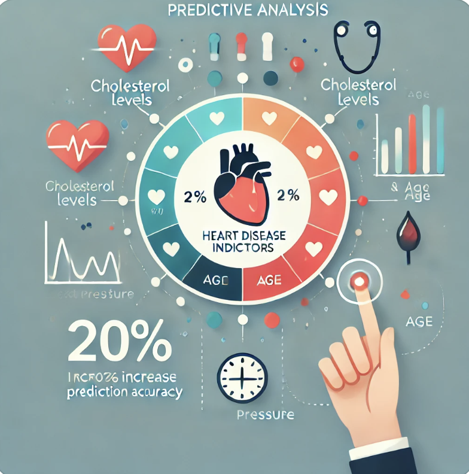
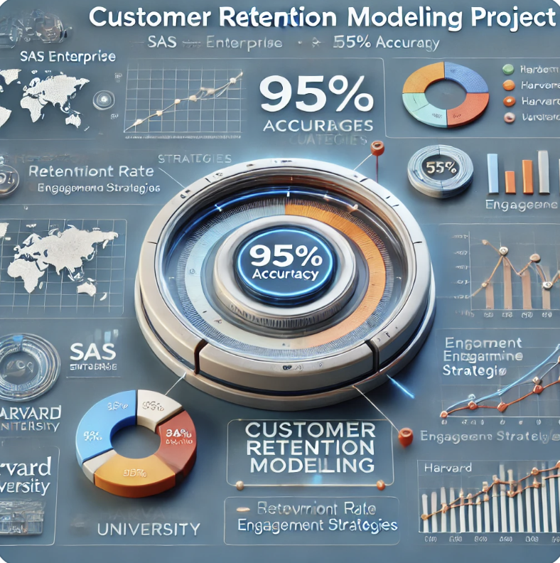

# Business Analyst | Data Analyst | Product Analyst

#### Programming Skills: Python (Pandas, NumPy, Matplotlib, Seaborn), SQL
#### Visualization Tools: Tableau, MS Visio Studio, MS-Excel (Excel Macros and VBA), Power BI, MS PowerPoint
#### Project Management: Business Processes, Agile, Methodologies, JIRA
#### Technical Skills: SAS Enterprise Guide, Statistical Modelling, SAP, ERP, Data Modelling, Predictive Modelling, AWS

## Education							       		
- **M.S. in Business Analytics** | Suffolk University (_May 2024_) 			        		
- **B.Com** | Jesus and Mary College, Delhi University (_July 2021_)

## Work Experience
**Teaching Assistant | Suffolk University (_Sept 2023 - May 2024_)**
- Scheduled and coordinated 50+ meetings with students to provide targeted feedback on R code and data analysis techniques, enhancing their programming proficiency by 25%.
- Managed email correspondence with 60+ students and professor, promptly addressing 95% of queries within 24 hours and facilitating effective communication regarding coursework and assignments.
- Maintained records of 200+ assignments and organized 15 class agendas per semester, improving grades by 30% and student engagement by 20%.

**Business Analyst | AON (_July 2021 - July 2023_)**
- Gathered requirements from stakeholders and senior management, defining project scope and objectives, contributing to a 15% improvement in project alignment.
- Conducted detailed data analysis for forecasting, budgeting, and resource allocation in compensation and benefits, enhancing financial planning efficiency by 20%.
- Utilized MySQL and Excel to provide insights, improving strategic financial planning and decision-making processes for clients by 25%.
- Designed and maintained reports and interactive dashboards in Tableau and Power BI, supporting data-driven decisions and boosting business growth and efficiency by 30%.
- Collaborated with IT teams to optimize data tools, automating report generation processes and reducing manual effort by 25-30%.
- Managed KPIs within the compensation database, aligning strategic objectives and enhancing operational productivity by 20%.
- Applied statistical analysis and predictive modeling with Python, optimizing compensation strategies and achieving 20-30% cost savings.

## Projects
### Predictive Analysis of Heart Disease Indicators
- Utilized SAS Miner and Advanced Excel to analyze over 50,000 rows of data on heart disease indicators, enhancing data-driven insights.
- Identified key predictors of heart attacks, supporting medical research and preventive healthcare strategies, and achieving a 20% increase in prediction accuracy.

### HR Analytics and Visualization with Power BI

- Executed a comprehensive HR Analytics project using Power BI and Power Query to visualize and analyze over 10,000 employee records, delivering detailed insights.
- Delivered actionable insights that improved workforce management and strategic HR decision-making, leading to a 15% increase in employee retention.

### Customer Retention Modeling

- Led a retention modeling project based on a Harvard University case study, utilizing SAS Enterprise to analyze over 50,000 customer records.
- Achieved 95% accuracy in forecasting customer retention rates, informing targeted engagement strategies and increasing retention by 20%.

## Talks & Lectures
- **Guest Lecture**: Selected as a distinguished scholar student to deliver a guest lecture for the upcoming Master of Science in Business Analytics (MSBA) cohort at Suffolk University, showcasing expertise in business analytics and industry insights, (_Spring 2024_)
- **Teaching Assissance Lecture**: A brief Introduction to Data analysis using R to over 100 students, (_Spring 2024_)
